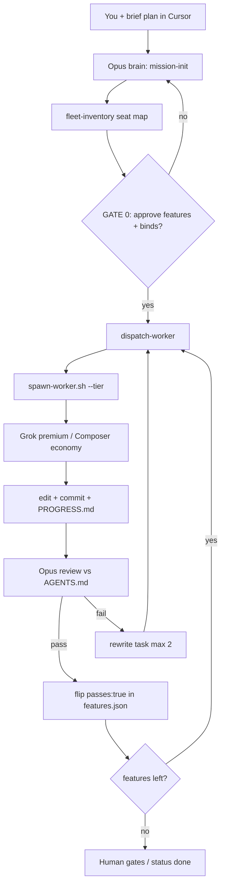
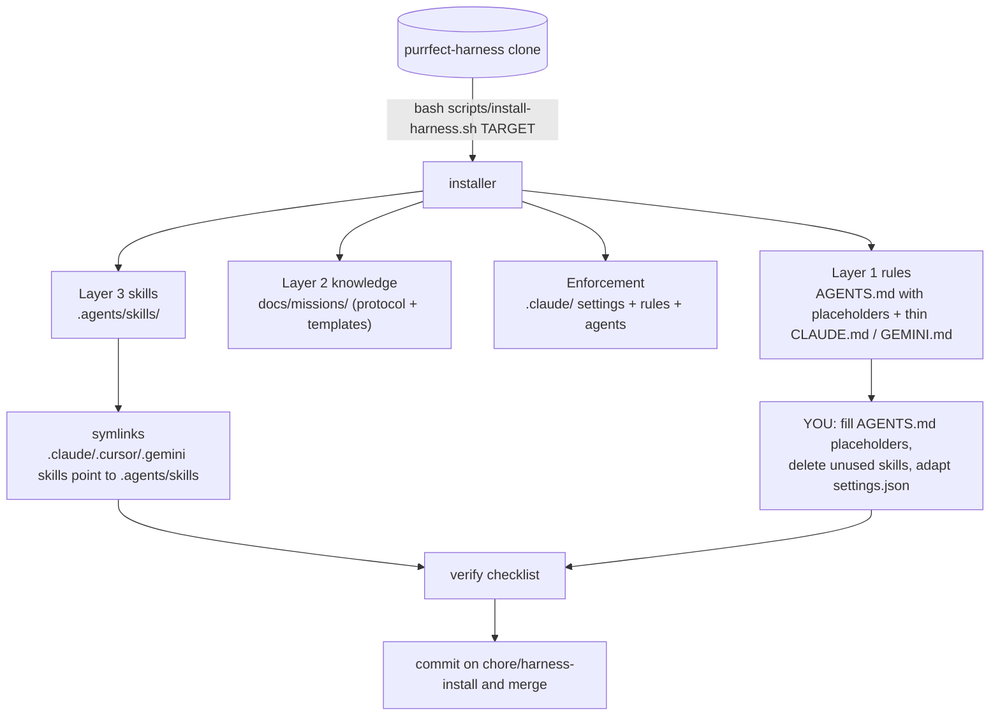
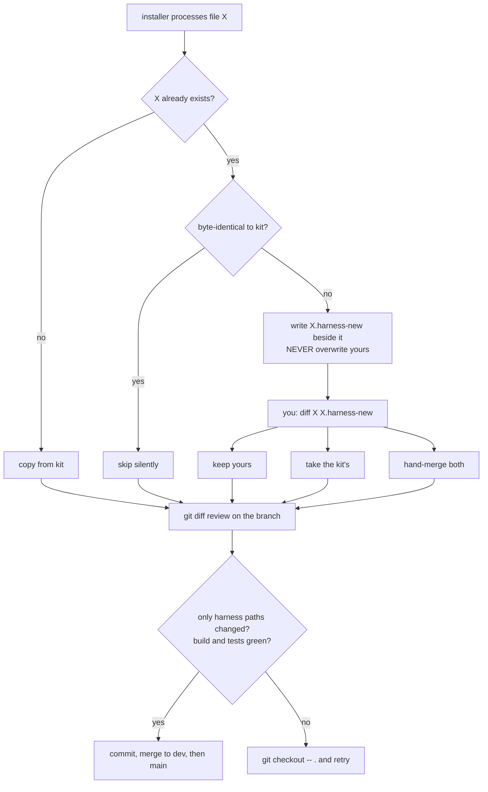
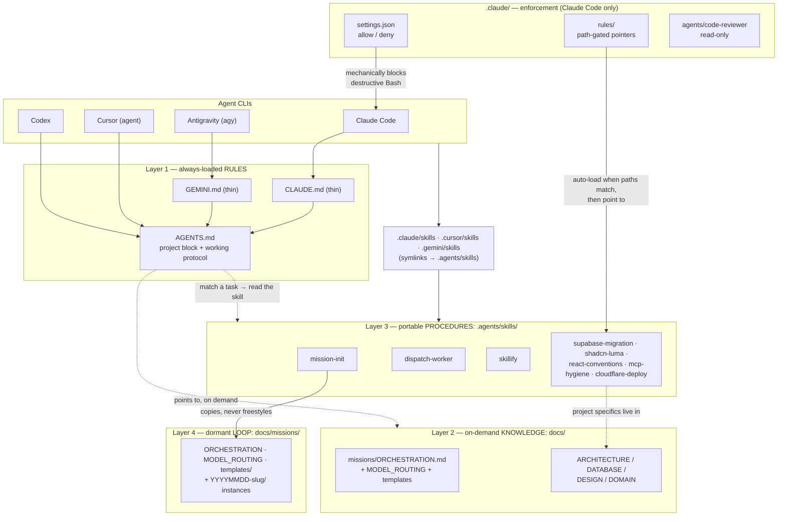
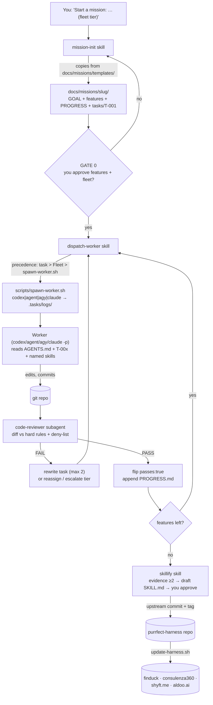

# Agent Harness Kit

[](https://github.com/hashorva/purrfect-harness/releases)
[](LICENSE)
[](docs/missions/MODEL_ROUTING.md)
[](docs/missions/MODEL_ROUTING.md)
[](docs/missions/README.md)
[](https://agentskills.io)
[](https://github.com/hashorva/purrfect-harness/actions/workflows/ci.yml)

A portable orchestrator/worker setup for AI-assisted development. Drop it into any
repo (FinDuck, shyft.me, consulenza360, …), fill one project block in `AGENTS.md`,
and every agent reads the same contract. **Opus** chairs missions by default;
**Cursor Grok** (premium) and **Composer** (economy) implement via local CLIs —
Codex and Antigravity (`agy`) are also in the fleet when you assign them. The loop
lives under `docs/missions/` (not repo-root GOAL files).



## The four layers (the studio operating rule)

1. **AGENTS.md** = always-loaded RULES (short; every session pays for it)
2. **docs/** = on-demand KNOWLEDGE (architecture, domain, design — loaded when relevant)
3. **.agents/skills/** = portable PROCEDURES (v2 universal skills; single source, cloned per repo)
4. **docs/missions/** = the dormant LOOP (activates when a mission folder has status in-progress|awaiting-gate)

If content is in the wrong layer, move it — a fat AGENTS.md is context rot by design.

## Design principles (why it's built this way)

1. **Agent Skills open standard.** All reusable procedures live as `SKILL.md` folders under
   `.agents/skills/`. The format is the agentskills.io standard originally from Anthropic,
   now supported by Claude Code, Codex, Cursor, Gemini CLI and ~40 other tools. Write once,
   every worker reads it. `scripts/sync-skills.sh` symlinks the canonical folder into each
   tool's discovery path.
2. **Progressive disclosure.** Only skill name + description load at startup (~50 tokens
   each). The body loads when triggered. Detail goes in `references/`. This is the anti-
   context-rot mechanism: knowledge on disk, not in the window.
3. **One universal root.** `AGENTS.md` is the master context file. `CLAUDE.md` and
   `GEMINI.md` are thin wrappers importing it. Only the `PROJECT` block of `AGENTS.md`
   changes per repo — everything else is agnostic.
4. **Goal file = JSON feature list, not prose.** Per Anthropic's long-running-agent
   research: agents one-shot and declare victory early when goals are prose. A
   `features.json` with `passes: false` items, edited only by flipping `passes`, fixes
   both failure modes. `GOAL.md` holds the narrative; `features.json` holds the truth.
5. **One feature per worker session, clean state at the end.** Session protocol: get
   bearings → verify nothing is broken → one feature → test → commit → update PROGRESS.md.
6. **MCP is a tool, not furniture.** Query MCP, write the result to a file, work from the
   file. Don't keep servers hot in a worker's context. See the `mcp-hygiene` skill.

## Purrfect Install

Installing and updating are different operations with different tools. **Install**
(`scripts/install-harness.sh`) is the first contact: it must respect whatever the
repo already contains, so its collision rule is *never overwrite — propose*.
**Update** (`scripts/update-harness.sh`) runs on repos already under harness
management: it may overwrite, but only kit-owned manifest paths. Both refuse
dirty trees, both work on a branch, neither ever commits — the human owns history.

### Install in a new repo



A "new" repo means: git-initialized with a baseline commit, but no AGENTS.md and
no `.harness-version` yet (a brand-new shyft.me, one day). Everything copies in
cleanly because nothing collides. What the script does by default:

```bash
# the whole payload is copy-if-absent:
PAYLOAD=$(find .agents/skills docs/templates .claude/rules .claude/agents -type f; \
          echo "docs/ORCHESTRATION.md"; echo ".claude/settings.json"; ...)
for f in $PAYLOAD; do copy_one "$f"; done
# and discovery symlinks, skipping any that exist:
[ -e "$TARGET/$tool/skills" ] || ln -s ../.agents/skills "$TARGET/$tool/skills"
```

What remains manual, always — the script cannot know your project:
1. **Fill `AGENTS.md`** — every `{{placeholder}}` (stack, repos, hard rules,
   commands). Example: FinDuck's block forbids `getDB()` on personal-data routes;
   consulenza360's forbids `supabase db push` (GitHub-integration apply path).
   Under ~200 lines; overflow goes to `docs/`.
2. **Prune skills** — no Supabase in this repo? `rm -rf .agents/skills/supabase-migration`.
3. **Adapt `.claude/settings.json`** — allow this repo's real commands, deny its
   real dangers.
4. Run the verify checklist below, commit, merge.

### Install in an existing repo



An "existing" repo (a finduck) probably already has an AGENTS.md, its own docs/,
maybe earlier skill versions. The installer's contract: **your files always win
the first round.** Three cases per file — absent → copied; identical → skipped;
different → the kit's version lands as `X.harness-new` and yours is untouched:

```bash
if [ ! -e "$dst" ]; then cp "$src" "$dst"                     # absent -> copy
elif diff -q "$src" "$dst" >/dev/null; then :                  # identical -> skip
else cp "$src" "$dst.harness-new"; fi                          # different -> propose
```

`AGENTS.md` gets stricter treatment: if one exists it is never even proposed
against — the kit skeleton arrives as `AGENTS.md.template`, and re-shaping your
content into it is deliberate human work (your content is the truth, the
template is only the structure).

What to check before merging — the ritual, in order:
1. **`git diff --stat`** — every path should be a harness path or a `.harness-new`.
   Anything else appearing = stop, investigate.
2. **Resolve every `.harness-new`**: `diff -u file file.harness-new` (or the
   editor's compare view). Typical outcome on a repo like finduck: your
   project-customized skill is *older* than the kit's v2 — take the kit's, then
   move any project-specific line it contained into `docs/` where it belongs.
   Delete the `.harness-new` when done; none may survive the merge.
3. **`ls -la .claude/skills`** — confirm symlinks resolve (existing symlinks are
   left alone; a macOS Finder alias would have been skipped, replace it by hand).
4. **Build + tests green** — the install must be inert for the running app; if a
   markdown-only change broke the build, something is deeply wrong: revert.
5. Merge to `dev` first if the repo has one; `main` only after a normal review.
   Never install directly on `main` in a repo that auto-deploys (finduck does).

### Verify checklist (both flavors, before committing)

- [ ] `claude` in the repo → "which skills do you see?" lists the kit skills
- [ ] `cat .claude/skills/mission-init/SKILL.md` resolves through the symlink
- [ ] AGENTS.md contains zero `{{` and is under ~200 lines
- [ ] No `*.harness-new` files remain
- [ ] `.harness-version` exists (updates depend on it)
- [ ] Build/tests green

## How the pieces trigger each other

### Anatomy — who reads what


### Mission lifecycle — what triggers what


## What's in the box

| Path | Role |
|---|---|
| `AGENTS.md` | Universal root context (project block + agnostic rules) |
| `CLAUDE.md`, `GEMINI.md` | Thin wrappers → AGENTS.md |
| `docs/missions/ORCHESTRATION.md` | The loop: orchestrator protocol, worker dispatch, review gates |
| `docs/missions/MODEL_ROUTING.md` | GATE 0 / mission-advance model routing (mission-scoped only) |
| `docs/missions/templates/` | GOAL / features / PROGRESS / WORKER_TASK templates |
| `docs/missions/<slug>/` | Instance mission (project-owned; updater never deletes) |
| `.agents/skills/` | Canonical skills (portable, agnostic core) |
| `scripts/sync-skills.sh` | Symlinks skills into every tool's path |
| `scripts/active-mission.sh` | Resolve the single active mission folder |
| `scripts/spawn-worker.sh` | Spawn local CLI workers with economy pins + logs |

## Claude Code enforcement layer (.claude/)

The portable layers above are GUIDANCE — any model can ignore prose. For the
orchestrator (Claude Code) the kit adds an ENFORCED layer, which Cursor/Codex/
Gemini do not read (their safety remains the AGENTS.md prose + task deny-lists):

- `.claude/settings.json` — permissions: destructive commands (`rm -rf`,
  `db reset`, force-push) are denied mechanically; routine verification commands
  (typecheck, tests, git read-ops, migration dry-run) are pre-allowed so sessions
  don't stall on prompts. Credential files are deny-listed from reads.
  Extend per project; add hooks (e.g. PostToolUse formatters) as needed.
- `.claude/rules/` — path-gated pointers: touching `supabase/**` or UI paths
  auto-loads a 10-line rule pointing at the relevant skill + docs. Automatic
  progressive disclosure; the canonical knowledge stays in the portable layers.
- `.claude/agents/code-reviewer.md` — a read-only subagent (Read/Grep/Glob only)
  for the REVIEW step of the loop: fresh context, physically cannot edit,
  verdicts are PASS/FAIL with file:line findings and a flywheel note.

Deliberately NOT included (see docs: code.claude.com/docs/en/claude-directory):
`commands/` (superseded by skills), `output-styles/` (personal/cosmetic),
`workflows/` (save one from /workflows AFTER the loop is proven manually),
`.mcp.json` (per-project, add when a repo needs a server), `settings.local.json`
/ auto-memory / agent-memory (personal or Claude-written, never committed by you).

## Updating consuming repos (ownership model)

Every path has exactly one owner, and ownership decides what an update may touch:
KIT-OWNED (overwritten by updates): the manifest skills in .agents/skills/,
docs/missions/{ORCHESTRATION,MODEL_ROUTING,README,templates}, path stubs,
.claude/rules/, .claude/agents/, kit scripts (sync/update/active-mission/spawn-worker).
PROJECT-OWNED (never touched): AGENTS.md, CLAUDE.md/GEMINI.md, product docs/,
docs/missions/<YYYYMMDD-*>/ instance folders, project-specific skills. MERGED:
.claude/settings.json — updates write a .new file for manual diff, never overwrite.

Two laws: (1) never edit a kit-owned file inside a consuming repo — project
specifics go in docs/ or a project-only skill; (2) improvements flow UPSTREAM
first (repo learns → skillify → commit here → tag → propagate), never sideways.

Propagate with: `bash scripts/update-harness.sh /path/to/repo` — requires a
clean target tree, works on a branch, records .harness-version, and leaves the
commit decision to you.

## Rules of ownership

- **Orchestrator (Opus/Sol; Fable on escalation):** writes mission folder GOAL + features,
  writes worker tasks, spawns local CLIs via spawn-worker.sh, reviews diffs, updates
  AGENTS.md when decisions change. Never absorbs fleet work into one chat when CLIs exist.
- **Workers (agent / Codex / agy / Claude Haiku):** implement exactly one task file at a
  time via their CLI, follow skills, commit, append to mission PROGRESS.md. Never edit
  features.json descriptions — only flip `passes` after verification.
- **You (human):** approve the feature list, review at gates, merge. Every correction
  you make in code review is a missing line in AGENTS.md or a skill — add it there,
  not just in the diff.
